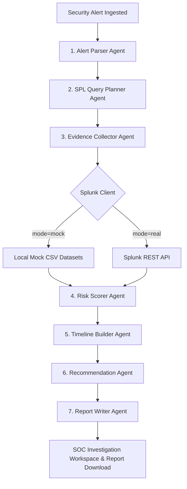

# Splunk SentinelOps AI — SOC Triage Assistant

**Splunk SentinelOps AI** is an intelligent, human-in-the-loop Security Operations Center (SOC) investigation and response assistant built for the **Splunk Agentic Ops Hackathon** under the **Security Track**.

It bridges the gap between Splunk's industry-leading log indexing capabilities and the reasoning of AI agent pipelines. It automatically parses security alerts, plans and generates Splunk search queries (SPL), retrieves evidence from Splunk, maps attack steps to a chronological incident timeline, calculates rule-based risk scores, and drafts audit-ready incident reports—all while keeping a human analyst in control of response playbooks.

---

## 🎯 Track Alignment: Security

SentinelOps AI addresses the fundamental bottleneck of modern SOCs: alert fatigue and manual cross-log correlation. It automates log search generation, aggregates multi-source evidence, computes risk scores transparently, and queues mitigation playbooks. It ensures an auditable, explainable threat triage pipeline that drastically lowers Time to Investigate (TTI).

### 🛑 Problem Statement
Security operations centers (SOCs) are overwhelmed by thousands of security alerts daily. Analysts must manually log into systems, formulate complex Splunk SPL queries, stitch together disparate firewall, login, and command-line execution logs, calculate the severity, and document their findings in reports. This manual process takes hours, leading to high triage delay and allowing active threats to dwell undetected.

### 💡 Value Proposition
Splunk SentinelOps AI automates the initial 80% of security triage within seconds:
- **Speeds Triage**: Generates and executes target SPL queries automatically.
- **Explainable Analysis**: Produces a clear, chronological event timeline and evidence-backed risk score.
- **Safety First**: Keeps the human analyst in the loop (HITL) for high-risk response actions (e.g. host quarantine, credential rotation).
- **Audit Ready**: Automatically drafts comprehensive markdown incident reports.

---

## 🔌 Integration Status (Honest Assessment)

| Layer | Status | Notes |
|---|---|---|
| **Splunk Enterprise REST API** | 🟢 Live & Verified | Primary integration path. Executes live search jobs against local Splunk instances; risk calculations match real events (`risk_score=100`, `risk_level=Critical` for main demo). |
| **AI Gateway (Mock / OpenAI / Gemini)** | 🟢 Live & Pluggable | Default is mock fallback; optional API engines load when keys are provided in backend configuration. |
| **Splunk MCP Server & App Tooling** | 🟡 Blueprint Only | MCP-ready configurations (`tools.conf`, `tool_input_payload_signatures.json`, `savedsearches.conf`) are packaged as a future-ready blueprint. |
| **Splunk Hosted Models & AI Service** | 🛑 Not Live | Future work; dependent on Splunk Cloud entitlement. |

> [!NOTE]
> **Honest Status / Safe Wording**: The live integration path is Splunk Enterprise REST API. MCP-ready assets are included as a future-ready blueprint, but live MCP execution was not enabled because the local development Splunk KV Store remained blocked by a certificate-chain / SSL validation issue.

---

## 🚀 Key Features

*   **Alert Queue**: A structured dashboard to ingest, review, and prioritize pending security alerts.
*   **Agentic Investigation Workflow**: A cooperative cascade of 7 specialized AI security agents (Alert Parser, SPL Query Planner, Evidence Collector, Risk Scorer, Timeline Builder, Recommendation Agent, and Report Writer).
*   **Generated SPL Queries**: Transports threat context into precise Splunk SPL search queries visible to the analyst in the workspace.
*   **Real Splunk REST Evidence Collection**: Direct connection via REST API to pull live authentication, endpoint command-line, and firewall egress logs.
*   **Evidence-Backed Risk Scoring**: Deterministic, transparent evaluation of risk indicators (e.g., failed logins, admin escalation, PowerShell execution) producing scores up to `100` (Critical) for the main demo alert (`alert-001`).
*   **Incident Timeline**: Correlates auth failures, command executions, and network volume into a clean, vertical chronological view.
*   **Human-in-the-Loop (HITL) Recommendations**: Interactively queues playbooks (such as host blocking) requiring explicit analyst approval before recording audit state.
*   **Markdown Incident Report Exp  ort**: One-click download of audit-ready incident reports containing queries, timelines, and action summaries.

---

## ⚙️ Architecture Profile

SentinelOps AI coordinates a multi-agent cascade that maps from alert ingestion to analyst review:



- **Frontend**: Next.js 16 App Router + Tailwind CSS. Accessible routes include:
  - `/` — SOC Command Center Dashboard.
  - `/alerts` — Alert Queue list.
  - `/alerts/[alertId]` — Detailed interactive triage workspace.
  - `/settings` — Integration status diagnostics and configuration.
  - `/about` — Architecture profile and project documentation.
- **Backend**: FastAPI (Python) exposing modular REST endpoints (`/alerts`, `/investigate`, `/export-report`, `/splunk/status`).
- **Splunk Indexer**: Connects to the `sentinelops` index via the management REST port `https://localhost:8089`.
- **AI Gateway**: Configured to run in mock mode by default, with provider-ready support for OpenAI and Google Gemini APIs when keys are active.

For a detailed diagram breakdown, see [docs/architecture-diagram.md](file:///g:/DevHack/Splunk_SentinelOps_AI/docs/architecture-diagram.md).

---

## 🛠️ Installation & Setup

### Prerequisites
- Python 3.10+
- Node.js 18+
- Splunk Enterprise (optional for Mock Mode, required for Real Mode)

### 1. Backend Setup
1. Navigate to the `backend` directory:
   ```bash
   cd backend
   ```
2. Install Python dependencies:
   ```bash
   pip install -r requirements.txt
   ```
3. Create and configure your environment file (`.env`):
   ```bash
   # Copy template
   cp .env.example .env
   ```
4. Start the Uvicorn application on port **8001** (matching the frontend expectations):
   ```bash
   uvicorn app.main:app --reload --port 8001
   ```

### 2. Frontend Setup
1. Navigate to the `frontend` directory:
   ```bash
   cd frontend
   ```
2. Install Node packages:
   ```bash
   npm install
   ```
3. Configure the local environment variables:
   ```bash
   # Create a local .env file
   # Note: Ensure NEXT_PUBLIC_API_BASE_URL points exactly to the FastAPI backend port
   echo "NEXT_PUBLIC_API_BASE_URL=http://127.0.0.1:8001" > .env.local
   ```
4. Run the development server:
   ```bash
   npm run dev
   ```
5. Open [http://localhost:3000](http://localhost:3000) in your browser.

---

## 📊 Splunk Ingestion & Setup

To verify real mode execution, index the sample CSV datasets onto your Splunk Enterprise instance.

1. **Splunk Web Console**: Access your console at `http://localhost:8000`.
2. **REST API Endpoint**: Verify the management port is active at `https://localhost:8089`.
3. **Index Creation**: Create a new index named `sentinelops` with default settings.
4. **Data Ingestion**: Import the example files from [demo-data/](file:///g:/DevHack/Splunk_SentinelOps_AI/demo-data/) using the standard Splunk Add Data wizard. Match them to the following custom sourcetypes:
   - `auth_logs.csv` ➡️ Sourcetype: `sentinelops:auth`
   - `endpoint_logs.csv` ➡️ Sourcetype: `sentinelops:endpoint`
   - `firewall_logs.csv` ➡️ Sourcetype: `sentinelops:firewall`
   - `web_logs.csv` ➡️ Sourcetype: `sentinelops:web`
5. **Environment Configuration**: Set `SPLUNK_MODE=real` and input your Splunk credentials/token in `backend/.env`.

---

## 📺 Demo Walkthrough (Main Incident Case)

Follow these steps to demonstrate the end-to-end flow using the primary test case:

1. **Access the Application**: Open your browser to the Dashboard page at `http://localhost:3000`.
2. **Navigate to the Queue**: Click **Alerts** or go directly to `/alerts` to view the ingested alert list.
3. **Select Target Alert**: Locate and click on **`alert-001`** (Brute Force login cascade on target host `win-dc-01`).
4. **Trigger Investigation**: In the alert workspace, click the **Investigate** button. This invokes the backend FastAPI multi-agent pipeline.
5. **Review Risk and Evidence**:
   - Verify the calculated **Risk Score** is **`100`** with a severity of **`Critical`**.
   - Inspect the **Generated SPL Queries** planned by the agent.
   - Examine the parsed **Evidence Cards** showing matching login failures, admin escalations, and PowerShell commands queried via Splunk.
6. **Timeline & HITL**:
   - Review the vertical chronological **Incident Timeline** demonstrating the attack chain progression.
   - Inspect the queued mitigation playbook in the **Human-in-the-Loop** panel. Click **Approve** on the "Block Source IP" action to test analyst approval validation.
7. **Report Export**: Scroll to the report panel and click **Download Markdown Report** to save a local copy of the executive incident report.

---

## 🔧 Troubleshooting

### 404 Pages or Stale Routes
* **Symptom**: Navigating to `/alerts` or `/alerts/[alertId]` displays a Next.js 404 page.
* **Resolution**: 
  1. Terminate the Next.js process (`Ctrl + C` in the frontend terminal).
  2. Delete the `.next` build folder inside the `frontend` directory: `rmdir /s /q .next` (on Windows/PowerShell) or `rm -rf .next` (on Unix).
  3. Restart the server with `npm run dev`. On Windows, the Next.js route table cache can occasionally get out of sync with new dynamic folders.

### API Connection Failures
* **Symptom**: Dashboard displays offline status badges, or investigations fail to run.
* **Resolution**: 
  1. Confirm that the FastAPI backend is running on port **8001** (`uvicorn app.main:app --reload --port 8001`).
  2. Verify that `NEXT_PUBLIC_API_BASE_URL` in `frontend/.env.local` is set to exactly `http://127.0.0.1:8001`.
  3. Inspect your backend logs for any port conflicts or CORS issues.

---

## 📜 Repository Information & Requirements
- **License**: Released under the open-source [MIT License](file:///g:/DevHack/Splunk_SentinelOps_AI/LICENSE).
- **Architecture Diagram**: Refer to [docs/architecture-diagram.md](file:///g:/DevHack/Splunk_SentinelOps_AI/docs/architecture-diagram.md) for structural blueprints.
- **Dependencies**: All key dependencies are listed in `backend/requirements.txt` (FastAPI, uvicorn, requests, pandas, pytest, etc.) and `frontend/package.json` (Next.js, lucide-react, react, tailwindcss, etc.).
- **Example Data & Configurations**:
  - Sample ingestion files: [demo-data/](file:///g:/DevHack/Splunk_SentinelOps_AI/demo-data/)
  - Environment variable templates: `backend/.env.example` and `frontend/.env.example`
  - Splunk configuration manifests: [splunk-app/SplunkSentinelOps/](file:///g:/DevHack/Splunk_SentinelOps_AI/splunk-app/SplunkSentinelOps/)
