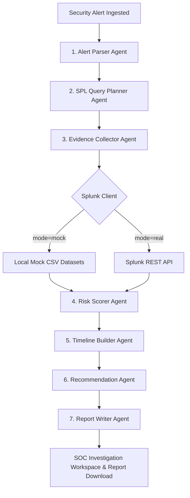

# Splunk SentinelOps AI — SOC Triage Assistant

**Splunk SentinelOps AI** is an intelligent, human-in-the-loop Security Operations Center (SOC) investigation and response assistant built for the Splunk Agentic Ops Hackathon.

It bridges the gap between Splunk's industry-leading log indexing capabilities and the reasoning of AI agent pipelines. It automatically generates search queries (SPL), retrieves evidence from Splunk, maps attack steps to a chronological incident timeline, calculates rule-based risk scores, and drafts executive markdown reports—all while keeping a human analyst in control of response playbooks.

---

## 🔌 Integration Status (Final — Submission)

| Layer | Status | Notes |
|---|---|---|
| **Splunk REST API** | 🟢 Live & Verified | Full pipeline runs against local Splunk Enterprise; `risk_score=100 Critical` confirmed |
| **Splunk MCP Server (Live)** | 🛑 Not Implemented | Local KV Store certificate-chain / SSL validation issue blocked token storage and tool discovery; 5 repair attempts exhausted |
| **Splunk AI Toolkit / Hosted Models** | 🛑 Not Implemented | KV Store failure blocked workspace; cloud entitlement not confirmed |
| **MCP-Ready App Assets** | 🟡 Included (Future-Ready) | `tools.conf`, `savedsearches.conf`, `tool_input_payload_signatures.json` packaged |
| **AI Gateway (Mock / OpenAI / Gemini)** | 🟢 Active | Pluggable; automatic mock fallback when keys absent |

> **Default demo mode**: Stable AI mock fallback + real Splunk REST evidence queries.
> Full technical rationale for MCP/KV Store status recorded in [`docs/bonus-access-check.md`](file:///g:/DevHack/Splunk_SentinelOps_AI/docs/bonus-access-check.md).


## 🚀 Key Features

*   **SOC Command Center Dashboard**: A sleek dark-themed workspace presenting threat severity distributions, active AI engines, and Splunk status diagnostics.
*   **Sequential Agentic Pipeline**: Orchestrates a pipeline of 7 specialized AI security agents (Alert Parser, SPL Planner, Evidence Collector, Risk Scorer, Timeline Builder, Recommendation Agent, and Report Writer).
*   **Transparent SPL Generation**: Translates high-level alert context into targeted Splunk search queries visible in the UI.
*   **Chronological Log Correlation**: Correlates auth, endpoint process commands, and firewall egress sockets.
*   **Explainable Risk Scoring**: Deterministically scores threats (0-100) based on clear evidence-based criteria.
*   **Human-in-the-Loop (HITL) Guardrails**: High-risk mitigations (such as blocking source IPs or forcing password resets) are queued as pending and only executed upon manual analyst approval.
*   **Markdown Incident Reports**: Generates downloadable executive write-ups summarizing threat timelines, queries, and remediation audit records.

---

## ⚙️ Architecture Profile

SentinelOps AI coordinates a multi-agent cascade:



---

## 🛠️ Quick Start (Local Mock Mode)

No API keys or running Splunk instance are required to run in developer mock mode.

### 1. Start the Backend
Navigate to the `backend` directory, install packages, and launch Uvicorn:
```bash
cd backend
pip install -r requirements.txt
uvicorn app.main:app --reload --port 8000
```

### 2. Start the Frontend
Navigate to the `frontend` directory, install NPM dependencies, and start Next.js:
```bash
cd frontend
npm install
npm run dev
```
Open `http://localhost:3000` to access the SOC workspace.

---

## 🔎 Real Splunk Manual Verification — Completed

The application has been successfully tested and verified end-to-end against a live **Splunk Enterprise** installation.

### Integration Details
*   **Splunk Web Console**: http://localhost:8000
*   **Splunk REST API Management Port**: https://localhost:8089
*   **Backend Real Mode Endpoint**: http://127.0.0.1:8001
*   **Frontend Web Dashboard**: http://localhost:3000
*   **Active Index**: `sentinelops`
*   **Custom Sourcetypes Indexed**:
    *   `sentinelops:auth`
    *   `sentinelops:endpoint`
    *   `sentinelops:firewall`
    *   `sentinelops:web`

### Verified API Outcomes

#### 1. Integration Status Ping (`GET /splunk/status`)
```json
{
  "connected": true,
  "mode": "real",
  "configured": true,
  "index": "sentinelops",
  "auth_method": "Basic",
  "message": "Connection verification successful"
}
```

#### 2. Root Cause Investigation (`POST /investigate` with `alert-001`)
Successfully executed real Splunk search jobs, returning:
*   `alert_id`: `"alert-001"`
*   `risk_score`: `100` (Evidence-based Critical score)
*   `risk_level`: `"Critical"`
*   `generated_spl`: Correctly generated queries containing `extracted_host` checks.
*   `evidence`: Active evidence cards containing real Splunk log rows.
*   `timeline`: chronological event points (Brute force login cascade -> Admin access -> PowerShell commands -> Egress socket volume).
*   `report_markdown`: Fully drafted executive summary with Splunk search audits.

### Field Ingestion Mapping & Fallbacks
Splunk automatically overrides the default metadata `host` field during CSV upload with the ingestion local machine name (e.g., `ShoaibDESKTOP-I26TI8K`). The original CSV hostname value is indexed in the `extracted_host` field. 

SentinelOps SPL queries dynamically check both fields to guarantee mock and real mode compatibility:
```spl
(extracted_host="win-dc-01" OR host="win-dc-01")
```
The **Evidence Collector** automatically extracts and normalizes the host values (`extracted_host` -> `host`) so that downstream timeline builders and risk scorers remain fully compatible with both mock datasets and real index results.

---

## 🤖 Pluggable AI Gateway (Optional)

The backend features a pluggable AI client that supports local mock summaries, OpenAI (`gpt-4o-mini`), and Google Gemini (`gemini-1.5-flash`) models.
- **Default (Zero-Config)**: Runs in `AI_MODE=mock` without any API keys or internet requirements, returning structured mock investigations out of the box.
- **Optional API Engines**: Set `AI_MODE=openai` or `AI_MODE=gemini` and load the respective `OPENAI_API_KEY` or `GEMINI_API_KEY` in `backend/.env`.
- **Fail-Safe Fallback**: If keys are missing, API calls fail, or requests time out (max 20 seconds), the system automatically falls back to mock summary templates. Risk scoring and response recommendations remain fully deterministic and are never modified by the AI.

---

## 🎯 Model Context Protocol (MCP) & Developer Tools Alignment

SentinelOps AI packages a lightweight Splunk app skeleton to showcase developer tool alignment and Model Context Protocol integration possibilities.

### 1. MCP-Ready Splunk App Configurations
All configurations are structured in [splunk-app/SplunkSentinelOps/](file:///g:/DevHack/Splunk_SentinelOps_AI/splunk-app/SplunkSentinelOps/):
- `default/tools.conf` & `default/tool_input_payload_signatures.json`: Maps threat investigation capabilities as standard MCP tools with strict JSON schema inputs.
- `default/savedsearches.conf`: Defines the pre-defined security search definitions for target indexes.

Once a **Splunk MCP Server** is deployed in your Splunk environment, these configuration files allow the searches to be automatically registered and exposed to LLM clients as tools. This supports the **Best Use of Splunk MCP Server** bonus track.

> **Honest Status**: The Splunk MCP Server app (v1.2.0) was installed on the local Splunk Enterprise instance. However, live MCP Server execution could **not** be completed because the local **KV Store (MongoDB) failed due to a local Splunk KV Store certificate-chain / SSL validation issue**. Without a working KV Store, the MCP Server cannot store authentication tokens or register tool configurations. Five controlled repair attempts were made and rolled back safely. The active demo uses the verified **Splunk REST API** integration exclusively. Full diagnostic details: [`docs/bonus-access-check.md`](file:///g:/DevHack/Splunk_SentinelOps_AI/docs/bonus-access-check.md).

### 2. Developer AppInspect Guidelines
A developer documentation guide explaining Splunk AppInspect validation constraints, manifest metadata schemas, and Splunkbase listing criteria is located at [docs/appinspect-notes.md](file:///g:/DevHack/Splunk_SentinelOps_AI/docs/appinspect-notes.md).


