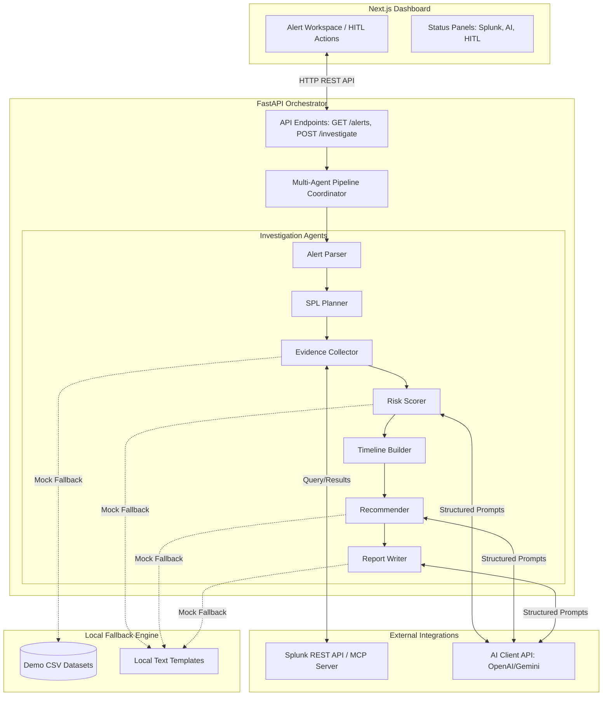

# Splunk SentinelOps AI - System Architecture

This document outlines the architecture, data flow, agent interactions, and error handling for the **Splunk SentinelOps AI** assistant.

---

## 1. High-Level Architecture

Splunk SentinelOps AI consists of three key architectural blocks:
1.  **Frontend Dashboard (Next.js)**: A responsive, dark-themed dashboard presenting active alerts, interactive investigation workspaces, SPL code blocks, and human-in-the-loop action approval controls.
2.  **Orchestrator Backend (FastAPI)**: Coordinates API routes, loads static configuration, handles logging, and manages execution of the agentic investigation pipeline.
3.  **Data & AI Layer**: Integrates with Splunk Enterprise via a REST Client (with fallback to synthetic local CSV logs) and connects to LLMs (Gemini/OpenAI) via a pluggable wrapper (with fallback to localized offline templates).

### System Diagram



---

## 2. Dynamic Investigation Flow

The step-by-step lifecycle of an alert investigation is as follows:

```
[SOC Analyst]                  [Next.js UI]               [FastAPI API]             [Agent Orchestrator]             [Splunk REST API]          [AI Provider]
     |                              |                           |                            |                              |                      |
     |--- 1. Click "Investigate" -->|                           |                            |                              |                      |
     |                              |--- 2. POST /investigate ->|                            |                              |                      |
     |                              |                           |--- 3. Run Pipeline ------->|                              |                      |
     |                              |                           |                            |--- 4. Extract target host -->|                      |
     |                              |                           |                            |--- 5. Generate SPL queries ->|                      |
     |                              |                           |                            |--- 6. Execute SPL searches ------------------------>|
     |                              |                           |                            |                              |<-- 7. Return Logs --|
     |                              |                           |                            |--- 8. Run scoring logic ----------------------------|--> [Evaluate Risk]
     |                              |                           |                            |--- 9. Build chronological timeline -----------------|--> [Format Timeline]
     |                              |                           |                            |--- 10. Request recommendations ---------------------|--> [Generate recommendations]
     |                              |                           |<-- 11. Pipeline Result ----|                              |                      |
     |                              |<-- 12. Update Dashboard ---|                           |                              |                      |
     |                              |                           |                            |                              |                      |
     |--- 13. Approve Action ------>|                           |                            |                              |                      |
     |                              |--- 14. POST Action Approve|                            |                              |                      |
     |                              |    (Simulate Mitigation)  |                            |                              |                      |
```

---

## 3. Integration Modes & Fallbacks

### 3.1 Splunk Integration Flow
The `Evidence Collector Agent` operates in one of two modes depending on environmental configurations:
*   **Splunk Mode**: Submits search queries using standard username/password basic credentials against the Splunk index. The job is monitored in a polling loop until the results are ready, then formatted as dictionary objects.
*   **Mock Mode**: If `SPLUNK_URL` is undefined or connectivity checks fail, the application reads the `demo-data/` CSV files using standard pandas/python readers and filters results locally based on matching attributes (IP, Host, Username) within a set time-window of the alert.

### 3.2 AI Integration Flow
*   **AI Connected Mode**: Sends instructions and JSON schema layouts to OpenAI/Gemini endpoints to draft summaries and recommendations.
*   **Mock AI Mode**: If no AI API key is defined in the environmental variables, the system executes deterministic mock logic:
    *   Generates a template markdown incident report.
    *   Fills template placeholders with values retrieved during evidence collection.
    *   Assigns a baseline list of recommendations associated with the detected attack stage.

### 3.3 Human-in-the-Loop Safety Model
The safety model ensures that **no** automated action is executed directly on the infrastructure:
1.  All high-impact operations are flagged with `requires_approval: true`.
2.  The UI displays a clear distinction between approved, rejected, and pending suggestions.
3.  Approvals send state updates to the FastAPI server, which writes changes strictly to an in-memory session store (simulating execution) rather than triggering real system adjustments.
