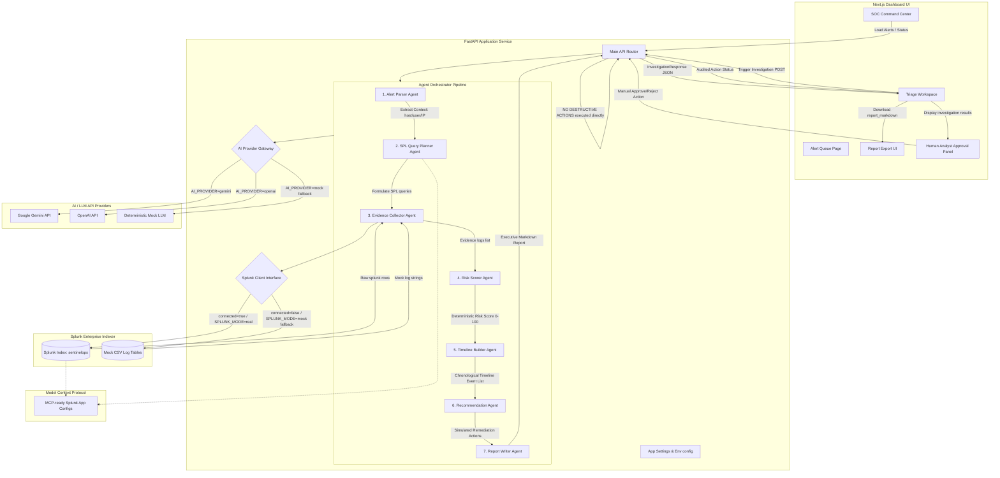

# Architecture Diagram — Splunk SentinelOps AI

This document provides a visual and structural representation of the **Splunk SentinelOps AI** application architecture, highlighting the data flow, pluggable service interfaces, multi-agent pipeline, and the human-in-the-loop safety model.

---

## 🎨 System Architecture & Data Flow

---

## 🔍 Core Component Descriptions

### 1. Frontend Command Center (Next.js & React)
*   **SOC Dashboard**: Renders overall security posture counters, integration connectivity health check badges, and settings profiles.
*   **Triage Workspace**: Displays generated SPL queries, formatted Splunk logs (Evidence Cards), a vertical chronological incident timeline, and an interactive Executive Report preview.
*   **HITL (Human-in-the-Loop) Panel**: Enforces security safety. Destructive remediation actions (like credential rotation or blocking traffic) are queued for review; clicking "Approve" updates the backend audit log without running live destructions.

### 2. FastAPI Gateway Router
*   Exposes endpoints `/alerts`, `/investigate`, `/export-report`, and `/splunk/status`.
*   Directs configuration checks, validates models via Pydantic schemas, and manages background execution.

### 3. Cooperative Multi-Agent Pipeline
*   **Alert Parser**: Extracts key threat properties (user, host, source_ip, timestamp).
*   **SPL Query Planner**: Formulates precise SPL search queries based on the extracted context.
*   **Evidence Collector**: Queries the live Splunk index or fallbacks to parsing mock CSVs.
*   **Risk Scorer**: Evaluates threat factors deterministically (failed logins, PowerScript execution, and egress traffic volumes) and returns a score up to `100` (Critical).
*   **Timeline Builder**: Chronologically threads all auth, firewall, and endpoint logs.
*   **Recommendation Agent**: Generates tailored response playbooks.
*   **Report Writer**: Synthesizes all data into an executive incident report.

### 4. Pluggable Connectors & Resilient Fallbacks
*   **Splunk Client**: Executes search jobs via `/services/search/jobs` using Username/Password or API Tokens. If Splunk is offline or the mode is set to mock, it falls back to reading static CSV datasets.
*   **AI Provider Gateway**: Routes language requests to OpenAI or Gemini. If API keys are missing, the system utilizes a rule-based mock AI pipeline to guarantee zero-dependency developer execution.
*   **MCP-ready App Assets**: Configuration skeleton mapping saved searches to MCP tools for model integration (see [splunk-app/SplunkSentinelOps/](file:///g:/DevHack/Splunk_SentinelOps_AI/splunk-app/SplunkSentinelOps/)).
